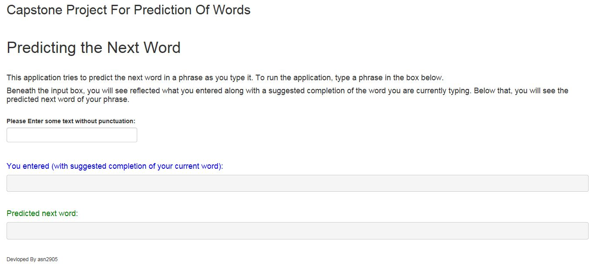

Capstone Predictive Model Presentation
========================================================
author: asn2905
date:  Dec-23-2017
autosize: true

Introduction
========================================================

<small>The Coursera Data Science Specialization Capstone project from Johns Hopkins University (JHU) allows to work on the prediction model. For this iteration of the class, JHU partnered with SwiftKey 
(http://swiftkey.com/en/) to apply data science in the area of **natural language processing**.

The application is the capstone for the Data Science specialization. This presentation is a brief explanation of the objetives, the methodology and the use of the application. The main goal of this capstone project is to build a shiny application that is able to predict the next word. The project was divided into tasks:

  - Data cleaning
  - Exploratory analysis
  - Predictive model
  - Shiny application

The data used in the model came from a **corpus** called HC Corpora (www.corpora.heliohost.org). A corpus is body of text, usually containing a large number of sentences.

<small></small></small>

Algorithm Development
========================================================

- The HC Corpora data was sampled.
- The sample was cleaned by conversion to lowercase and by removing punctuation, links, white space, numbers and special characters.
- Contiguous sequences of 2, 3 and 4 items from a given sequence of text or speech (n-grams).
- 2-gram, 3-gram and 4-gram were used to create frequency matrices.
- The results were storaged in .rds files

The Shiny Application
========================================================

<small>Using the algorithm, a Shiny (http://shiny.rstudio.com/) application was developed that accepts a phrase as input, suggests word completion from the unigrams, and predicts the most likely next word based on the linear interpolation of trigrams, bigrams, and unigrams. 
The application uses text documents collected from blogs, news articles, and twitter to statistically model language patterns. N-Grams, Markov Model and Katz's back-off model were used to predict the next word. The modeling process used a large set of data so it was batched. The batch process created a much smaller set of data to be used in the application for fast real-time performance. The web-based application and data files can be found in below location.

## Link  

- <a href="https://asn2905.shinyapps.io/Shiny_App-Capstone_Project_Next_Word_Prediction/"> Link to Shiny App</a>. 

</small>

Using the Application
========================================================

<small>Use of the application is straightforward and can be easily adapted to many educational and 
commercial uses. As depicted below, the user begins just by typing some text without punctuation in 
the supplied input box. As the user types, the text is echoed in the 
field below along with a suggested word completion. At the bottom of the screen, the 
predicted next word in the phrase is shown.</small>

